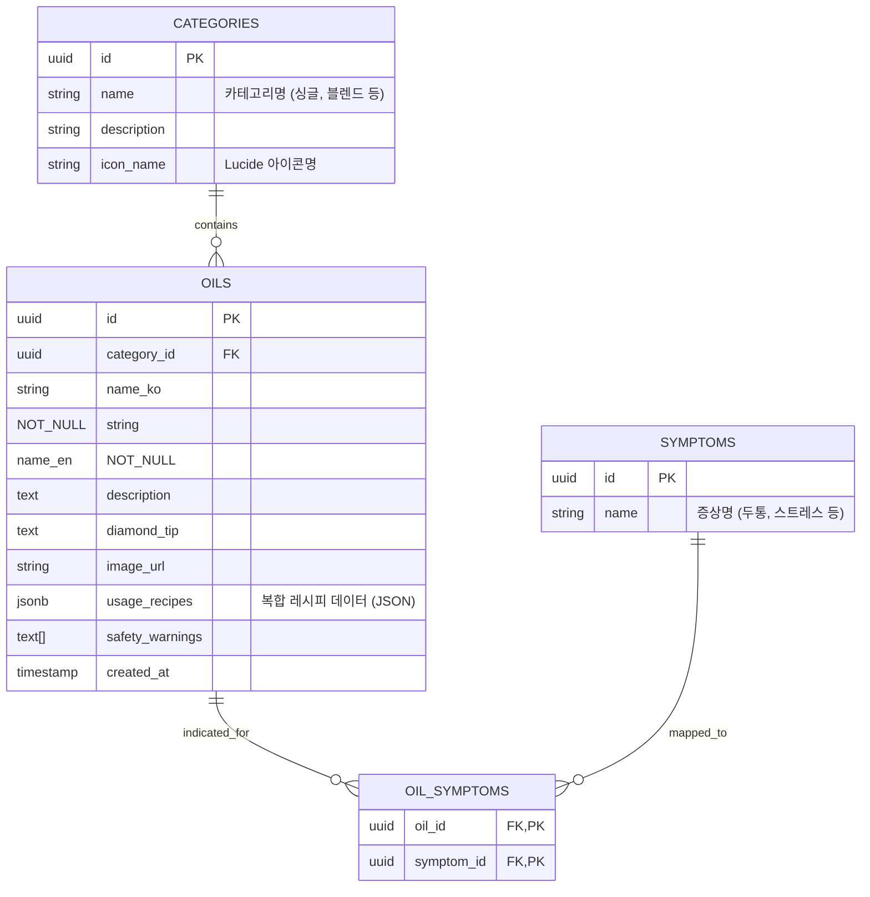

# AromaGuide Database Plan (DB_PLAN.md)

이 문서는 에센셜 오일 상담 서비스를 위한 데이터베이스 설계 및 인덱스 전략을 정의합니다. 현재의 단일 테이블 구조를 정규화하여 확장성과 무결성을 확보하는 것이 목표입니다.

---

## 🏗️ 1. ERD (Entity Relationship Diagram)

---

## 📊 2. 정규형(NF) 검토 및 개선

### 제1정규형 (1NF) 준수
- **현상**: 기존 `oils` 테이블의 `symptoms` 컬럼이 `TEXT[]` 배열로 저장되어 원자성 위배 소지가 있음.
- **해결**: `SYMPTOMS` 테이블과 `OIL_SYMPTOMS` 중간 테이블로 분리하여 다대다(M:N) 관계 명시.

### 제2정규형 (2NF) 준수
- **준수 여부**: 모든 속성이 기본키(ID)에 완전 함수 종속되어 있음.

### 제3정규형 (3NF) 준수
- **현상**: 오일 상세 정보에서 카테고리와 관련된 정보(설명 등)가 오일 테이블에 중복될 가능성 있음.
- **해결**: 카테고리 정보 전용 테이블 `CATEGORIES`를 생성하여 이행적 종속성 제거 (category_id FK 사용).

---

## 🛡️ 3. 데이터 정합성(Integrity) 및 제약 조건

1. **개체 무결성 (Entity Integrity)**:
    - 모든 PK는 `gen_random_uuid()`를 통해 고유하게 관리되며 `NOT NULL`.
2. **참조 무결성 (Referential Integrity)**:
    - `OIL_SYMPTOMS`에서 `oil_id` 삭제 시 `CASCADE` 옵션 적용 고려.
    - `category_id`는 삭제 시 `RESTRICT` 또는 `SET NULL` 처리.
3. **도메인 무결성 (Domain Integrity)**:
    - `name_ko`, `name_en`은 `NOT NULL` 제약 조건.
    - `usage_recipes`는 유연한 확장을 위해 `JSONB` 형식 유지 (Schema validation은 APP 레이어에서 처리).

---

## ⚡ 4. 인덱스(Index) 전략

| 테이블 | 컬럼 | 인덱스 타입 | 사유 |
|:---|:---|:---|:---|
| `OILS` | `name_ko`, `name_en` | **B-Tree** | 이름 검색 상시 발생 |
| `SYMPTOMS` | `name` | **B-Tree** | 특정 증상 필터링 시 성능 확보 |
| `OIL_SYMPTOMS` | `oil_id`, `symptom_id` | **Composite PK** | 조인 성능 최적화 |
| `OILS` | `category_id` | **B-Tree** | 카테고리별 그룹화 조회 |

---

## 🌐 5. API 엔드포인트 설계 (Supabase Client 기반)

- **GET `/oils?category_id=...`**: 카테고리별 오일 목록 조회
- **GET `/oils?symptom=...`**: 특정 증상에 맞는 오일 다중 조인 조회 (RPC 추천)
- **POST `/subscriptions`**: 메일링 구독 신청 추가 (정합성 보장 필요)

**작성일**: 2026. 04. 15.
**작성자**: Antigravity Database Architect
